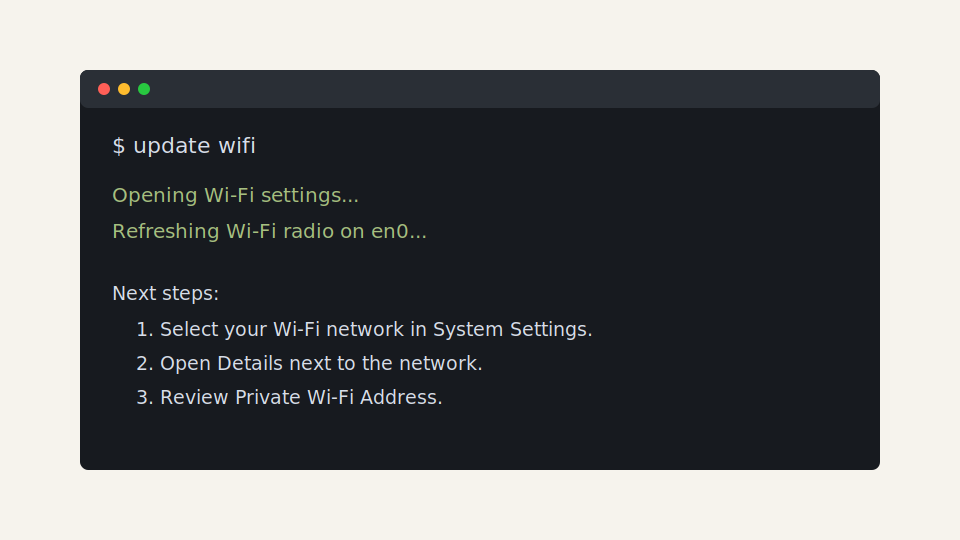
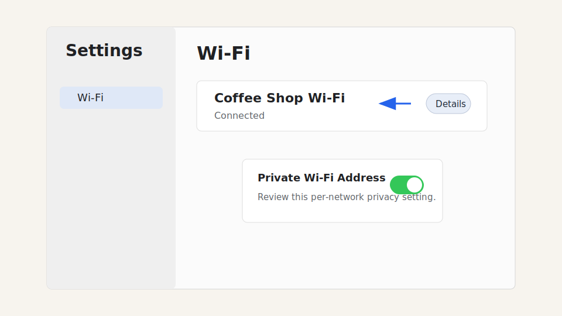

# Update Wi-Fi

I made this because I was tired of only getting to use cafe wifi or public wifi for 30-60 minutes and then getting booted off unless I paid. With this program, just install and type in "update wifi". It will reset your wifi by toggling your MacOS private wifi setting on and off, forcing a new wifi address. Thats it, enjoy!

`update wifi` is a small macOS terminal shortcut for legitimate Wi-Fi troubleshooting. It opens System Settings directly to Wi-Fi and refreshes the Wi-Fi radio so you can quickly review per-network privacy settings, captive-portal issues, or a flaky public hotspot connection.

It does not hack networks, bypass payment gates, or override venue rules. Use it only on networks you own or are authorized to use.



## Install

Clone the repo and run the installer:

```sh
git clone https://github.com/YOUR-USERNAME/update-wifi.git
cd update-wifi
./install.sh
source ~/.zshrc
```

Then run:

```sh
update wifi
```

To open Wi-Fi settings without cycling the radio:

```sh
update wifi --no-cycle
```

## What It Does

When you run `update wifi`, the helper:

1. Opens **System Settings > Wi-Fi**.
2. Finds your Mac's Wi-Fi hardware device.
3. Turns the Wi-Fi radio off, waits briefly, then turns it back on.
4. Prints the manual next steps for reviewing **Details > Private Wi-Fi Address** for the selected network.



macOS manages Private Wi-Fi Address per network. This tool intentionally leaves that choice in System Settings so you can make an informed change for the network you are actually using.

## Uninstall

```sh
./uninstall.sh
source ~/.zshrc
```

## Safety And Legality

This project is for privacy maintenance and troubleshooting. Do not use it to evade access controls, paid sessions, public Wi-Fi limits, or terms of service. Respect the network operator's rules.

## Development

Run the script directly from the repo:

```sh
./bin/update-wifi --help
./bin/update-wifi --no-cycle
```

The installer adds:

- `~/.local/bin/update-wifi`
- a zsh function so the two-word command `update wifi` works

## Public Visibility

This repository can be public, but it is not open source. No license is granted
to copy, modify, redistribute, sublicense, or sell this code unless the owner
adds a license later.
